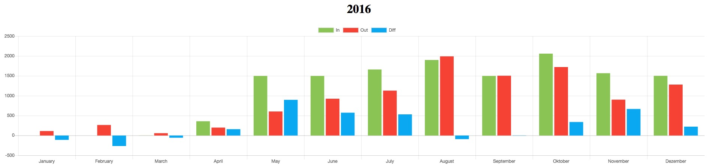

# MoneyMoney-BarCharts-Monthly
Export extension for the macOS app MoneyMoney (https://moneymoney-app.com) that exports a HTML file with up to three bar charts for each month (income, outgoing, difference). Charts.js (https://www.chartjs.org/) is used for generating the bar charts.

## Installation & Usage
Copy the lua file to the extension folder of MoneyMoney. Choose yearly overview. Then export the data and choose "Bar Charts (In/Out/Diff per Month)". Open the exported html file with your browser of choice.

## Configuration
It is possible to exclude one category in the calculation (e.g. "Umbuchungen"). To use this feature, open the lua file with an editor and 
change "excludeCategory = false" to "excludeCategory = true". The name of the category can be set in the following line.

## Example
Example output with some random numbers:

